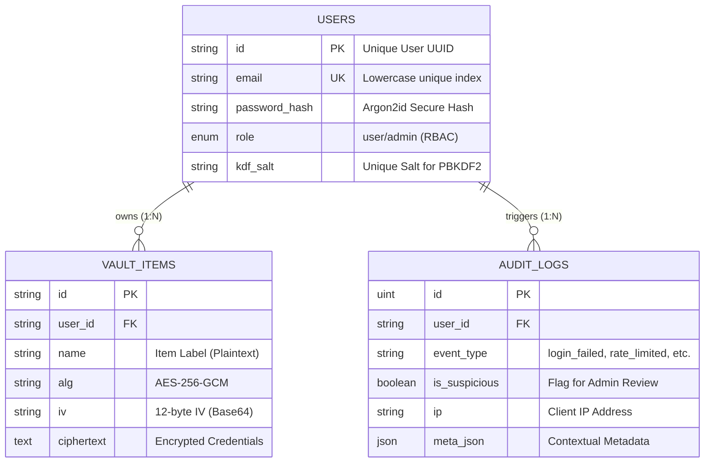

# Comprehensive Cybersecurity Project Report Guide

This document consolidates all technical details, architectural diagrams, and implementation logic required for the ICT306 Advanced Cybersecurity project report.

---

## 1. Project Architecture & Structure
The project follows a **Decoupled Full-Stack Architecture** to ensure a clear separation between the untrusted server and the secure client.

```text
assessment/
├── client/                 # Frontend: Responsible for ALL Encryption/Decryption
│   ├── src/
│   │   ├── lib/            # Core Cryptography (WebCrypto AES-GCM)
│   │   ├── components/     # Reusable Secure UI components
│   │   └── pages/          # Dashboard, Login, Register
├── server/                 # Backend: Secure Storage & API Orchestration
│   ├── src/
│   │   ├── controllers/    # Request handling (Auth, Vault, Audit)
│   │   ├── routes/         # Express Router definition
│   │   ├── db.js           # MySQL Schema & Audit Trail logic
│   │   └── middleware.js   # Security: CSRF, Rate-Limiting, RBAC
│   └── test/               # Mocha/Chai Professional Test Suite
├── docker-compose.yml      # Infrastructure as Code (MySQL Orchestration)
└── README.md               # SSDLC Phase Overview
```

---

## 2. Database Schema (Security-Focused)
The database is designed with **Zero-Knowledge** principles. We store only metadata and encrypted blobs.



---

## 3. Cryptography Deep-Dive (E2EE Flow)
This is the "Secret Sauce" of the project. We use **End-to-End Encryption (E2EE)** so the server never sees raw data.

### Step-by-Step Encryption Process:
1.  **Key Derivation**: 
    -   The user enters their **Master Password**.
    -   The client fetches the unique `kdfSalt` from the server.
    -   The client uses **PBKDF2-HMAC-SHA256** (250,000 iterations) to derive a 256-bit encryption key.
2.  **Encryption**:
    -   A random **12-byte IV (Initialization Vector)** is generated.
    -   The vault data is encrypted using **AES-256-GCM**.
    -   The `ciphertext`, `iv`, and `tag` are bundled and sent to the server.
3.  **Decryption**:
    -   The client downloads the encrypted bundle.
    -   The client re-derives the key from the Master Password.
    -   **AES-GCM** verifies the integrity tag and decrypts the data locally.

---

## 4. API Documentation
All endpoints are protected by **JWT Authentication** (via httpOnly cookies) and **CSRF Tokens**.

| Method | Endpoint | Description | Security Controls |
| :--- | :--- | :--- | :--- |
| **GET** | `/api/auth/csrf` | Fetch CSRF Token | CSRF Protection |
| **POST** | `/api/auth/register` | User Registration | Argon2id, Input Validation |
| **POST** | `/api/auth/login` | User Login | Rate Limiter, Argon2id |
| **GET** | `/api/vault` | List User's Vault | JWT Auth, Privacy Isolation |
| **POST** | `/api/vault` | Store Encrypted Item | JWT, CSRF, E2EE Proof |
| **GET** | `/api/admin/suspicious` | View Flagged Events | RBAC (Admin Only) |

---

## 5. Security Package Audit (Tech Stack)
Explain these packages in your report to demonstrate technical depth:

-   **`argon2`**: The industry-standard password hashing algorithm (resistant to GPU cracking).
-   **`helmet`**: Sets various HTTP headers to prevent XSS, Clickjacking, and Sniffing.
-   **`csurf`**: Protects against Cross-Site Request Forgery.
-   **`express-rate-limit`**: Mitigates Brute-Force and Denial of Service (DoS) attacks.
-   **`zod`**: Schema-based validation to prevent Malformed Input/Injection.
-   **`jsonwebtoken (JWT)`**: Stateless authentication stored in `httpOnly` cookies to prevent XSS-based token theft.
-   **`mocha/chai/supertest`**: Used for automated security verification.

---

## 6. Theoretical Background (Cybersecurity Foundations)
Include these concepts to meet the academic requirements of ICT306.

### A. The CIA Triad
-   **Confidentiality**: Achieved through **E2EE (AES-256-GCM)** and **Argon2id** hashing.
-   **Integrity**: Achieved through the **GCM (Galois/Counter Mode)** tag.
-   **Availability**: Protected by **Rate Limiting** and **Secure Session Management**.

### B. Defense in Depth (Layered Security)
Multiple layers: Network (CORS/Helmet) -> App (Zod/JWT/CSRF) -> Data (Encryption/Hashing).

### C. Zero Trust Architecture (ZTA)
Principle of **"Never Trust, Always Verify"**—the backend is treated as a compromised zone.

### D. Secure Software Development Lifecycle (SSDLC) Philosophy
**"Shift Left"** approach, integrating security requirements and Threat Modeling before coding.

---

## 7. Infrastructure & DevSecOps (Docker)
We use **Infrastructure as Code (IaC)** to ensure a secure, reproducible, and isolated environment.

### Docker Implementation:
-   **Containerization**: The database is isolated in a **Docker Container** (`spm-mysql`), preventing dependency conflicts and ensuring environment consistency.
-   **Image**: Using **MySQL 8.4** (Latest Long-Term Support) for improved security features and a hardened default configuration.
-   **Persistence**: Data is stored in a **Docker Volume** (`spm_mysql_data`), ensuring that data is preserved even if the container is recreated.
-   **Networking**: The DB is only exposed on the required port (`3306`), following the principle of **Least Privilege**.

### Secrets Management:
-   Sensitive credentials (DB passwords, JWT secrets) are stored in **Environment Variables** (`.env` file) rather than hardcoded in the source code.
-   The `.gitignore` file ensures these secrets are **never** committed to version control.

---

## 8. Implementation Evidence (Capture Guide)
Use these pointers to take your screenshots:

1.  **Network Tab (Payload)**: Capture a POST to `/api/vault`. Show that the password is **not** visible—only a `ciphertext` string.
2.  **Audit Log Proof**: Trigger a few failed logins and then log in as an **Admin** to show the events appearing in the "Suspicious Activity" list.
3.  **Testing Proof**: Run `npm test` in the server directory and screenshot the "green" passing tests.
4.  **Docker Proof**: Run `docker ps` to show the running `spm-mysql` container.
5.  **Security Headers**: Show the `Network > Headers` section in Chrome for any request to see `Strict-Transport-Security` (HSTS).
